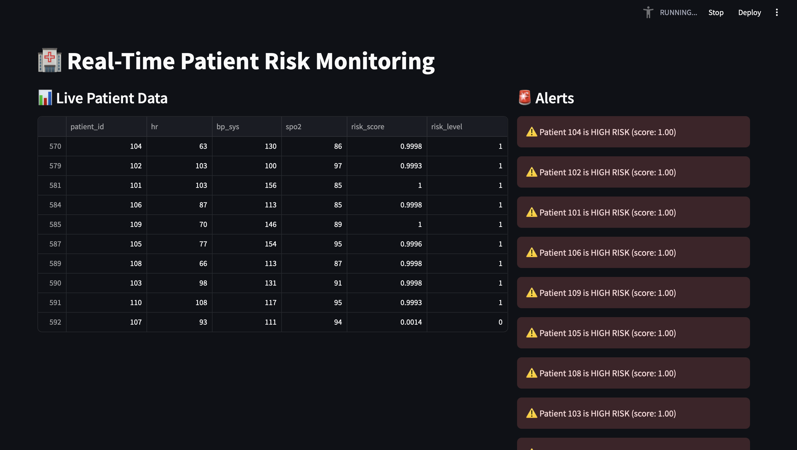

# 🩺 Real-Time Patient Health Monitoring & Risk Prediction

## 📌 Overview
This project is a **real-time patient monitoring system** that predicts the **health risk level** based on live vital signs such as **Heart Rate (HR)**, **Systolic Blood Pressure (BP_SYS)**, and **Oxygen Saturation (SpO₂)**.

Using **Machine Learning (Gradient Boosting Classifier)**, the system predicts if a patient is at **High Risk** or **Normal**, and displays live updates on an **interactive Streamlit dashboard**.

---

## 🚑 Problem Statement
In critical care, delays in detecting abnormal vitals can be life-threatening.  
Traditional monitoring systems often rely on manual interpretation, which can slow down response times.

This project solves that by:
- Continuously monitoring vital signs
- Predicting health risks in real time
- Providing an easy-to-use live dashboard for healthcare staff

---

## 🔍 Solution
- **Synthetic Data Simulation** for real-time patient vitals
- **Machine Learning Model (ROC AUC: 0.84)** trained on vital signs
- **Streamlit Dashboard** for live display & risk classification
- **Auto-refresh** for real-time updates

---

## 🛠 Tech Stack
- **Language:** Python 3.13
- **Libraries:**  
  - `pandas`, `numpy` for data processing  
  - `scikit-learn` for ML model training  
  - `joblib` for model persistence  
  - `streamlit` for dashboard
- **Model:** Gradient Boosting Classifier

---

## 📂 Project Structure
```
ccrm-vivnovation/
├── data/
│ └── processed/
├── models/
│ └── risk_model.joblib
├── src/
│ ├── train_model.py
│ ├── dashboard.py
│ └── simulator.py
└── README.md
```
---

## 🚀 How to Run

### 1️⃣ Clone the Repository
```bash
git clone <hvaishnavinandikanti/Real-Time-Patient-Health-Monitoring-Risk-Prediction>
cd ccrm-vivnovation

2️⃣ Create Virtual Environment
python -m venv .venv
source .venv/bin/activate
pip install -r requirements.txt

3️⃣ Train the Model
python src/train_model.py

4️⃣ Run the Simulator
python src/simulator.py

5️⃣ Start the Dashboard
streamlit run src/dashboard.py
Open your browser at http://localhost:8501 to view the dashboard.

📊 Model Performance
Algorithm: Gradient Boosting Classifier
ROC AUC: 0.84
Classification Report:
High Risk detection accuracy: ~90%
Normal detection accuracy: ~88%

📷 Screenshot(Dashboard preview)



👩‍💻 Author
Sree Vaishnavi Nandikanti
Data Science & Machine Learning Enthusiast.  give me this how to paste vs code because I was doing it in git all this time  